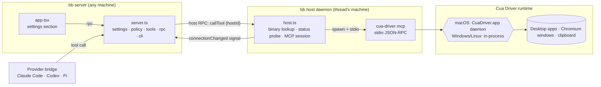
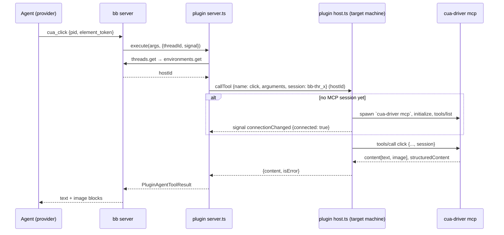
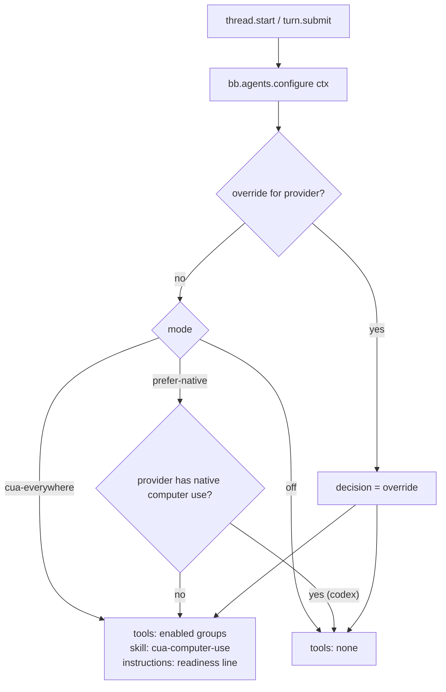

# Architecture

## Components

## A tool call, end to end

## Session configuration

## Process model per OS

| OS | What `cua-driver mcp` does | Who owns permissions | bb daemon requirement |
| --- | --- | --- | --- |
| macOS | proxies to the LaunchServices-launched `CuaDriver.app` daemon over a 0600 Unix socket | `CuaDriver.app` (Accessibility, Screen Recording) | none beyond a logged-in user |
| Windows | owns the runtime in-process | the interactive session the daemon runs in | daemon must run in an interactive session (not Session 0 / SSH) |
| Linux (X11/XWayland) | owns the runtime in-process | AT-SPI + X server | daemon inside the graphical session |

## Lifecycle rules the plugin relies on

- Plugin tools and skills are static registrations; `configure()` only selects
  them per resolution. Changes land on the next provider session start.
- Host workers are lazy and evicted after 5 idle minutes unless retained; the
  plugin retains the worker only while an MCP session is open and releases it
  on the 10-minute idle disconnect, so an idle machine runs no extra process.
- Reload replaces the server registration set atomically; the host worker
  moves to the new generation on its next call.
